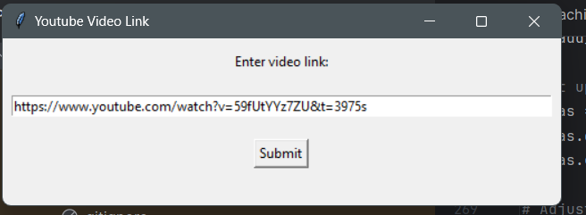
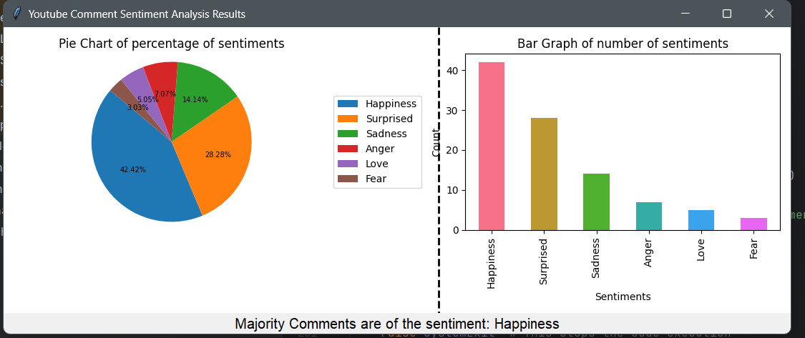

# 🎯 YouTube Comment Sentiment Analysis

This project performs **Sentiment analysis on YouTube video comments** using a transformer-based NLP model. It includes automated **data extraction from YouTube**, **data cleaning**, **training a custom machine learning model**, and **interactive visualization** of sentiment distributions via a Tkinter GUI.


## 📌 Features

- 🔍 Extracts YouTube comments via YouTube Data API
- 🧹 Cleans comments by removing noise, stopwords, duplicates, etc.
- 🤖 Trains a **DistilBERT-based** sentiment classification model
- 📊 Visualizes results using **pie and bar charts** via Tkinter GUI
- 📈 Computes evaluation metrics: F1 score, accuracy, precision, recall

---

## 🛠️ Technologies Used

- Python
- Hugging Face Transformers
- PyTorch
- NLTK
- Pandas & NumPy
- Tkinter (for GUI)
- Matplotlib & Seaborn (for visualization)
- YouTube Data API (via `google-api-python-client`)
- Fast-ML (for train/validation/test splitting)

---

## 📂 Project Structure

```

├── input_screen.png
├── output_screen.png
├── README.md
├── sentiment machine learning model.py
└── sentiment_analysis_final_code.py


````

---

## 🚀 How to Run

### 1. Clone the Repository
```bash
git clone https://github.com/yourusername/youtube-sentiment-analysis.git
cd youtube-sentiment-analysis
````

### 2. Create a `.env` File

Create a `.env` file in the root directory and add your YouTube API key:

```env
YOUTUBE_API_KEY=your_actual_api_key_here
```

> ⚠️ Make sure `.env` is listed in `.gitignore`.

### 3. Install Dependencies

Use `pip` to install all required packages:

```bash
pip install -r requirements.txt
```

You may also need to download some NLTK resources:

```python
import nltk
nltk.download('punkt')
nltk.download('stopwords')
```

### 4. Train the Sentiment Model

Edit `sentiment machine learning model.py` to point to your dataset (CSV with comments and sentiment labels), then run:

```bash
python sentiment machine learning model.py
```

This will save your trained model in the `sentiment_model/` directory.

### 5. Analyze Comments from a YouTube Video

Run:

```bash
python predict_and_visualize.py
```

A GUI will appear asking you to paste a YouTube video link. The program will:

* Extract up to 100 comments (Can change as per the use case)
* Clean the text
* Predict sentiment using the trained model
* Display pie and bar charts of the sentiment distribution

---

## 📊 Sentiments Predicted

The model is trained to classify comments into the following categories:

* Anger
* Fear
* Happiness
* Love
* Sadness
* Surprise

---

## 📁 Data Source

The training dataset consists of YouTube comments on Oscar-nominated movies sourced from **Kaggle**, labeled by sentiment.

---

## 📈 Results

Evaluation metrics from the trained model:

* ✅ **Accuracy**: \~84% (Varies based on training)
* 📊 Interactive visualizations for insights
* 🏆 Useful for content creators, marketers, and platform moderators

---

## Inputs



## Outputs


## 🙏 Acknowledgements

* [Hugging Face Transformers](https://huggingface.co/transformers/)
* [YouTube Data API](https://developers.google.com/youtube/v3)
* [Kaggle](https://www.kaggle.com/)
* [Fast-ML](https://github.com/ritchieng/fast-ml)
